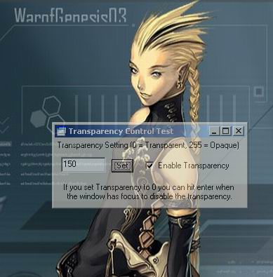



## AlphaBlend Control

### Description

This control allows you to set the transparency level of the form that it resides on. I wrote this a good while back when I was learning how to create controls in VB. It uses the SetLayeredWindowAttributes API that is available in Windows 2000. I believe this will work on Windows XP also. I haven't tried it though. A small test application is included to show you how to use the control. It's really simple. If you like it, please rate it and I'll post more code. :)
 
### More Info
 

             |
---                |---
**Submitted On**   |2001-04-20 19:30:38
**By**             |[James Johnston](https://github.com/Planet-Source-Code/PSCIndex/blob/master/ByAuthor/james-johnston.md)
**Level**          |Advanced
**User Rating**    |5.0 (30 globes from 6 users)
**Compatibility**  |VB 6\.0
**Category**       |[Custom Controls/ Forms/  Menus](https://github.com/Planet-Source-Code/PSCIndex/blob/master/ByCategory/custom-controls-forms-menus__1-4.md)
**World**          |[Visual Basic](https://github.com/Planet-Source-Code/PSCIndex/blob/master/ByWorld/visual-basic.md)
**Archive File**   |[AlphaBlend636333202002\.zip](https://github.com/Planet-Source-Code/james-johnston-alphablend-control__1-32863/archive/master.zip)

